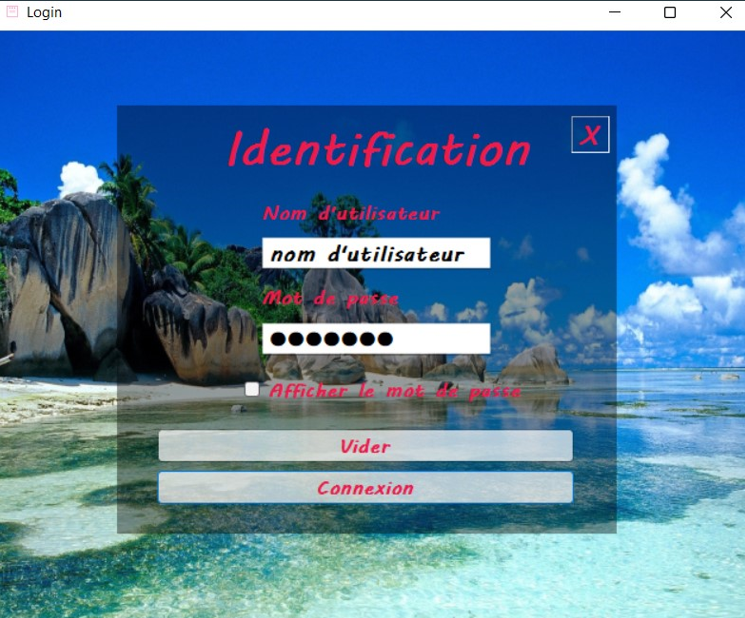
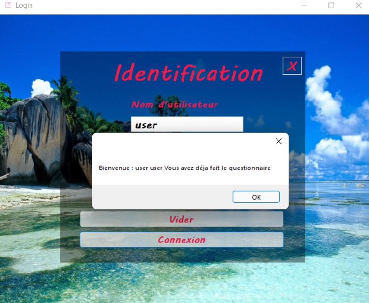
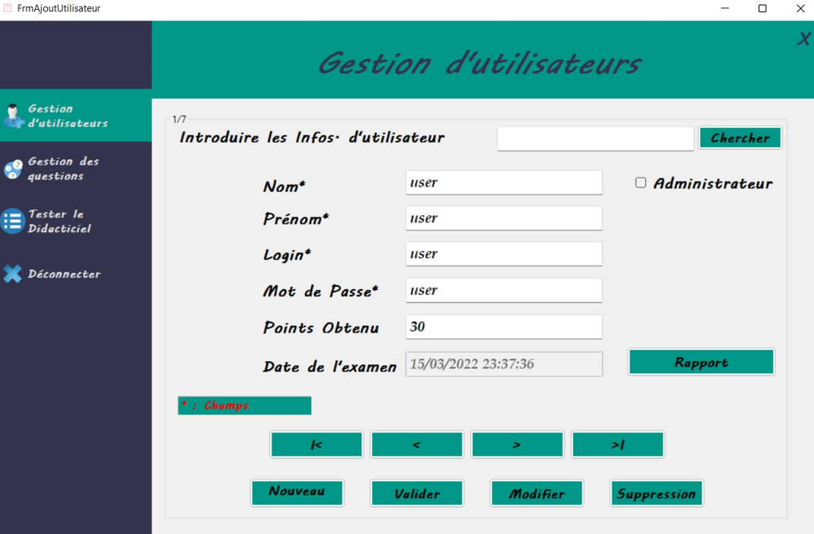
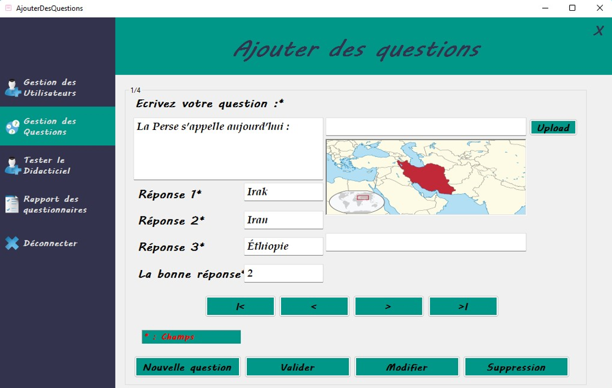
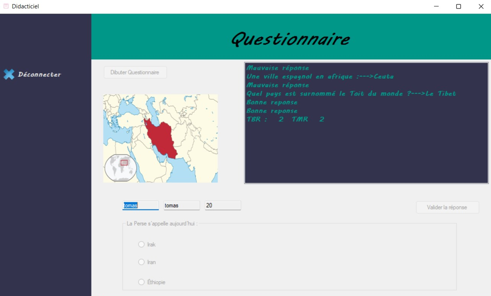
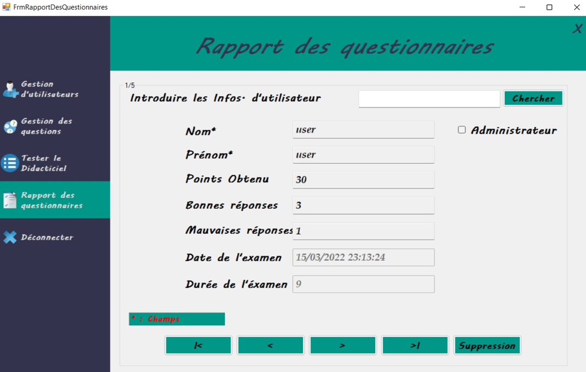

# TP – Application Didacticielle (C# WinForms)

Ce projet est un **travail pratique d’évaluation certificative** réalisé dans le cadre de l’UE *Principes Algorithmiques et Programmation* (2021–2022).  
L’objectif était de construire une **application didacticielle complète** en C# WinForms comprenant la gestion des utilisateurs, la gestion des questions, un système de quiz chronométré et un tableau de bord administrateur.

---

## Objectifs pédagogiques

- Manipuler les concepts fondamentaux de la programmation C# (conditions, boucles, gestion d’erreurs, classes, méthodes…)
- Utiliser les formulaires Windows Forms pour créer des interfaces graphiques
- Implémenter un système complet CRUD (Create, Read, Update, Delete)
- Séparer les rôles : **administrateur** et **utilisateur**
- Gérer un **questionnaire chronométré** avec résultats et rapports
- Produire une application structurée et maintenable

---

## Fonctionnalités principales

### Authentification
- Page de connexion avec vérification des identifiants  
- Redirection automatique selon le rôle :  
  - **Admin --> Tableau de bord**  
  - **Utilisateur --> Questionnaire**

---

### Gestion des utilisateurs (Admin)
- Ajouter un utilisateur  
- Modifier un utilisateur  
- Supprimer un utilisateur  
- Consulter la liste des utilisateurs  
- Affecter un rôle (Admin / User)

---

### Gestion des questions (Admin)
- Ajouter une question  
- Modifier une question  
- Supprimer une question  
- Ajouter une image à une question  
- Gestion des bonnes réponses  

---

### Questionnaire (Utilisateur)
- Questions tirées depuis la base interne  
- Temps limité par question (20–25 secondes)  
- Compteur de points  
- Passage automatique à la question suivante  
- Affichage du score final  

---

### Rapport de résultats
- Récapitulatif complet :  
  - nombre de bonnes réponses  
  - mauvaises réponses  
  - score final  
  - date et durée du test  
- Génération automatique d’un rapport  

---

## Structure du projet

- `ApplicationDidacticiel2022Soulayman.sln` : fichier solution  
- `ApplicationDidacticiel2022Soulayman/` : code source (forms, classes, ressources)  
- `DiagrammeDesClassesDidacticiel/` : diagramme UML  
- `Images/` : images des questions  
- `.gitignore` : ignore les dossiers temporaires (bin, obj, .vs)

---

## Captures d’écran de l’application

### Page de connexion

### Gestion des utilisateurs

### Gestion des questions

### Questionnaire

### Rapport des résultats

### Tableau de bord Admin

---

## 👨‍💻 Auteur

Projet réalisé par **Soulayman**, dans le cadre de l’évaluation certificative en C# WinForms.

---
